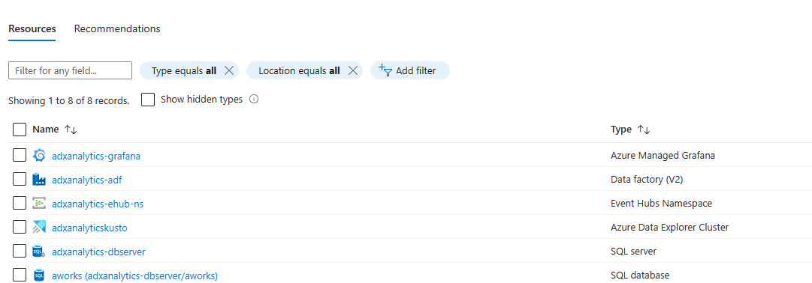
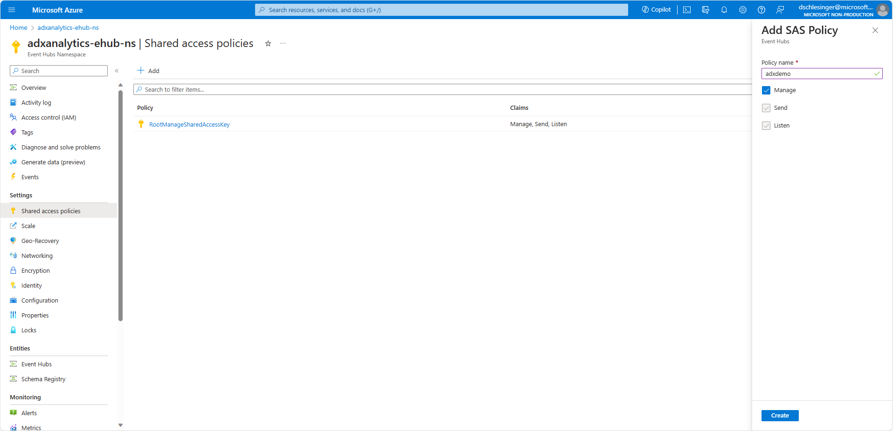
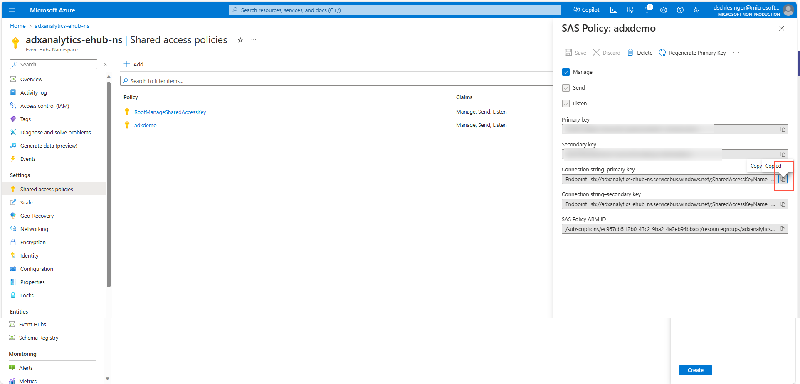
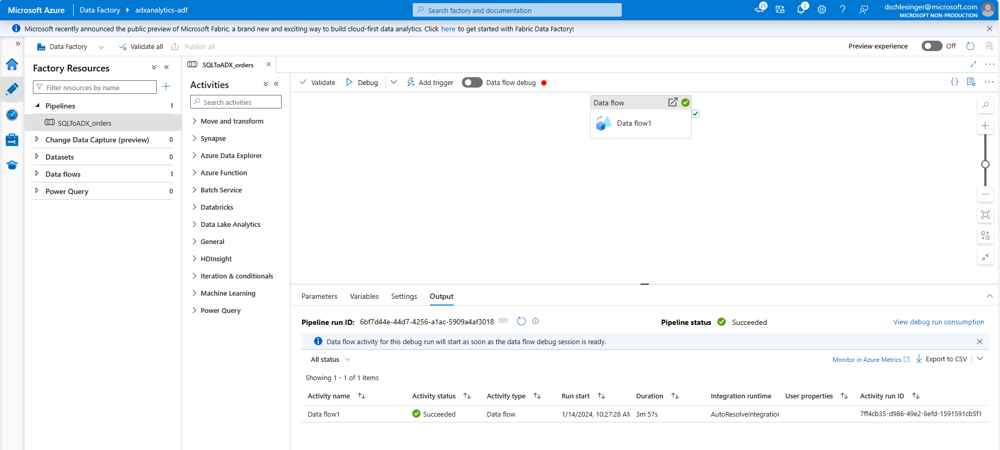
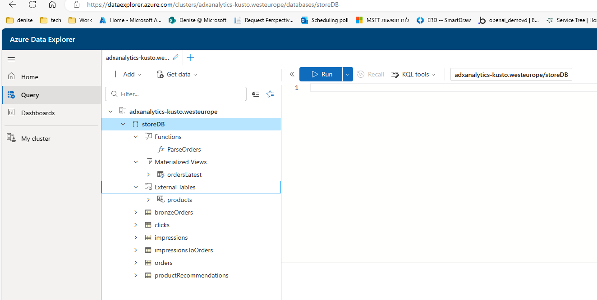

# Workshop - Building an Analytics platform using Azure Data Explorer (Kusto)
Created by: [Denise Schlesinger](https://www.linkedin.com/in/deniseschlesinger/)

# Introduction
Suppose you own an e-commerce website selling bike accessories.  
You have millions of visitors a month, you want to analyze the website traffic, consumer patterns and predict sales.  
This workshop will walk you through the process of building an end-to-end Data Analytics Solution for your e-commerce website.

You will learn how to:
* Build a star schema in Azure Data Explorer
* Build Data pipelines using Azure Data Factory for CDC (change data capture)
* Stream events into Azure Event hubs and ingest them into Azure Data Explorer
* Create data transformations in Azure Data Explorer 
* Use Notebooks to create product recommendations
* Create reports & Visualize the data using Power BI
* Create reports and Alerts connecting Grafana to Azure Data Explorer

## Workshop sections
[Introduction](#introduction)  
[Pre-requisites](#pre-requisites)  
[Build the infrastructure](#building-the-infrastructure)  
[Joining with external tables](#joining-with-external-tables)  
[Ingesting events into Azure Data Explorer from Event hub](#ingesting-events-into-azure-data-explorer-from-event-hub)  
[CDC using Azure Data Factory](#cdc-using-azure-data-factory)  
[Create synthetic events with orders](#create-synthetic-events-with-orders)  
[Visualization in Azure Data Explorer web UI](#visualization-in-azure-data-explorer-web-ui)  
[Visualization in PowerBI](#visualization-in-power-bi)  
[Visualization and alerts in Grafana](visualization-and-alerts-in-grafana)  
[Materialized views](#materialized-views)  
[ML in Azure Data Explorer](#ml-in-azure-data-explorer)  
[Monitoring](#monitoring)
[Additional information](#additional-information)

## Architecture

## Pre-requisites
* An Azure Account where you have admin permissions
* Python 3.7 running locally in your machine
* VsCode

# Building the infrastructure
## IMPORTANT!!!!! - Before running the scripts
* Change prefix to be unique in the [deployAll.bicep](<infrastructure scripts/deployAll.bicep>) file  
<code  style="color : orange">
param prefix string = 'adxanalytics'
</code>
 
* Add your user Id in the [deployAll.bicep](<infrastructure scripts/deployAll.bicep>) file here to be the Grafana admin:  
<code  style="color : orange">
@description('Specifies the object id of an Azure Active Directory user granted the Grafana Admin role')  
param userId string = '<grafana-admin-user-object-id>'
</code>
 
* Option 1: You can get your userID  by running the following command from the cloud shell in the Azure Portal  
<code  style="color : red">
az ad signed-in-user show --query id -o tsv
</code>
 
* Option 2:  by going in the Azure Portal to:  
Microsoft entra > Users
Search for your user and get the user Id as follows:  

## Run scripts to build all the Infrastructure
Run powershell scripts in the Azure portal Cloudshell

1. Go to the azure portal and login with a user that has administrator permissions
2. Open the cloud shell in the azure portal
3. Upload the file “all.zip” in the github repo by using the upload file button in the cloud shell
4. Unzip the file by writing unzip all.zip
5. Run ./createAll.ps1  

NOTE: This takes time so be patient !!

### The script above creates the following entities

# Post deployment 
### Define the event hub SAS (shared access policy) in [env](.env) file
- Go to the Event hub -> Shared access policies 
- Add
- Create a Policy called "adxdemo" with "Manage" privileges
- Save and copy the "Connection string–primary key"
- Paste into [env](.env) file the event hub connection string  

<code  style="color : orange">
EVENT_HUB_CONN_STRING = "<event hub connection string>"   
</code>

 

 

### Open Azure Data Studio and connect to our SQL DB
  

NOTE: since we are using SQL serverless, this step is used to "awake" our SQL server

### Open Azure Data Factory to run the Change Data Capture
In this step we "stream" all the orders from the "SalesOrderDetail" table in SQL to Kusto
- Go to the Azure Data Factory in the Created Resource Group
- Launch the ADF Studio
- Author -> Pipelines -> "SQLToADX_orders"
- Click on "debug"

### Create synthetic events by running a Notebook
- Follow the instructions in the [README file](notebooks/README.md) located in the [notebooks](notebooks) folder for creating a python virtual environment
- Run [Generate Synthetic events notebook](<notebooks/Generate synthetic events .ipynb>)

### Generate updates on the SQL SalesOrderDetail table
- If you did not create a python virtual environment yet, Follow the instructions in the [README file](notebooks/README.md) located in the [notebooks](notebooks) folder for creating a python virtual environment
- Run [Generate orders updates notebook](<notebooks/Generate orders updates.ipynb>)
- Run the CDC pipeline in Azure Data Factory to send the changes from SQL to Kusto (see [Open Azure Data Factory to run the Change Data Capture (CDC)](#open-azure-data-factory-to-run-the-change-data-capture) above

  
# EXERCISE 1 - Read data in Kusto
Your Kusto DB should look like this:  

 

- Copy all KQL queries to the Azure Data Explorer Web UI and run queries one by one
[Exercise 1 - KQL queries](KQL/exercise1.kql)
 

 

# EXERCISE 2 - Data visualization
- Visualization in Azure Data Explorer web UI
IMPORTANT!! - 
 
if you changed the "prefix" param in the [deployAll.bicep](<infrastructure scripts/deployAll.bicep>) file
 
You have to edit the JSON defining the ADX WEB UI Dashboard data source as follows:  

<code  style="color : orange">
    "dataSources": [
      {
        "id": "535ee10e-e104-4df6-a3eb-ac5cd7834691",
        "name": "storeDB",
        "scopeId": "kusto",
        "clusterUri": "https://prefix-kusto.westeurope.kusto.windows.net/",
        "database": "storeDB",
        "kind": "manual-kusto"
      }
    ],
</code>
 

 
- Visualization in PowerBI  

 
- Visualization and alerts in Grafana
 
# EXERCISE 3 - ML in Kusto
- ML in Azure Data Explorer

# Additional Information
### Joining with External tables
[Azure Data Explorer External tables](https://learn.microsoft.com/en-us/azure/data-explorer/kusto/query/schema-entities/external-tables)  
An external table is a schema entity that references data stored external to a Kusto database in your cluster.

In this workshop we created an external table in Kusto.

The "products" table in Kusto is actually the Product table in our SQL server DB, which we created in the [KQL script](<infrastructure scripts/script.kql>)   we run after creating the Kusto cluster

<code style="color : red">
.create external table ...
</code>
 
 

### Monitoring 
Setup diagnostic logs  
https://learn.microsoft.com/en-us/azure/data-explorer/using-diagnostic-logs?tabs=ingestion

Create an Azure alert on FailedIngestion table   
https://learn.microsoft.com/en-us/azure/azure-monitor/alerts/tutorial-log-alert

### Connecting to Kusto using authentication  
[How to configure an app registration to connect to Azure Data Explorer](https://learn.microsoft.com/en-us/azure/data-explorer/provision-entra-id-app)  

Add AAD user from another tenant to access from PBI to ADX   
.add database ['storeDB'] admins ("aaduser=user@microsoft.com;your aad tenant id here")  

Add AAD app to ADX as admin + run the following command inside ADX    
.add database ['your db name'] users ('aadapp=your app-id') 'Demo app put your comment here (AAD)'   

### Jaccard Similarity  
[Jaccard Similarity](https://www.geeksforgeeks.org/how-to-calculate-jaccard-similarity-in-python/)  
