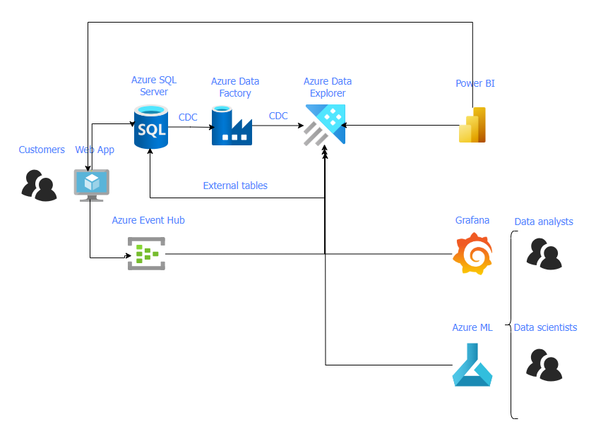

# ADX - Building an Analytics platform - workshop
Created by: [Denise Schlesinger](https://www.linkedin.com/in/deniseschlesinger/)

# Introduction
Suppose you own an e-commerce website selling bike accessories. You have millions of visitors a month, you want to analyze the website traffic, consumer patterns and predict sales.
This workshop will walk you through the process of building an end-to-end Data Analytics Solution for this E-commerce website.
You will learn how to:
* Build a star schema in Azure Data Explorer
* Build Data pipelines using Azure Data Factory for CDC (change data capture)
* Stream events into Azure Event hubs and ingest them into Azure Data Explorer
* Create data transformations in Azure Data Explorer 
* Use Notebooks to create product recommendations
* Create reports & Visualize the data using Power BI
* Create reports and Alerts connecting Grafana to Azure Data Explorer

# Architecture

# Pre-requisites
* An Azure Account where you have admin permissions
* Python 3.7 running locally in your machine

# 1- Building the infrastructure
## Run scripts to build all the Infrastructure
* Azure Data Explorer
* Azure Data Factory
* SQL server 
* "Adventure works" sample DB
* Azure Event hub 

## Manually create Azure Managed Grafana
Follow these instructions to provision Grafana
TBD

# 2- Run the CDC pipelines

# 3- Ingest events into Azure Data Explorer

# 4- Data visualization using Power BI

# 5- Connect Azure Data Explorer to Grafana

# 6- Create Product Recommendations

## Jaccard Similarity
https://www.geeksforgeeks.org/how-to-calculate-jaccard-similarity-in-python/

## Add AAD app to ADX as admin + run the following command inside ADX

.add database ['your db name'] users ('aadapp=your app-id') 'Demo app put your comment here (AAD)'

# Add AAD user from another tenant to access from PBI to ADX
.add database ['your db name'] admins ("aaduser=user@microsoft.com;aad tenant id")